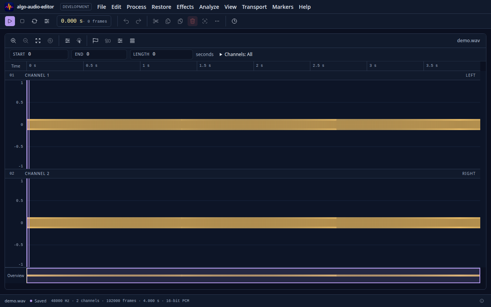

# algo-audio-editor

An audio editor that runs in the browser and as a desktop app. All sample
processing (editing, effects and analysis) happens in a **Go kernel**, compiled
to WebAssembly for the editor and natively for the CLI and MCP server, on top
of the [`algo-dsp`](https://github.com/cwbudde/algo-dsp) family. Portable codecs
run in Go; browser codec APIs extend format support.
The UI is **React + TypeScript + shadcn**.

[Try it in your browser](https://cwbudde.github.io/algo-audio-editor/) ·
[](https://github.com/cwbudde/algo-audio-editor/actions/workflows/ci.yml)

The public demo follows CI-tested `main` and is a **development build**. Open
your own file or choose **Open demo**; audio stays on your device.
See the [browser support matrix and deployment details](docs/web-deployment.md#browser-support).



> **Status:** Editing, processing, effects and analysis described in [PLAN.md](PLAN.md): WAV import/export,
> interactive waveforms, playback, channel-aware selections and editing in the
> browser and Electron, with undo/redo, persistent markers/regions, save-point
> tracking, shared commands and a searchable command palette. Processing includes
> gain, normalization, fades and a descriptor-driven effects rack with live
> preview, factory/user presets and cancellable, undoable offline application.
> Analysis adds playback metering, spectrum and spectrogram views, document
> statistics, pitch tracking and clipping markers.
> Audio import supports WAV, FLAC, AIFF/AIFC, MP3 and available browser codecs.
> Export adds FLAC, AIFF, 48 kHz Ogg Opus and browser-supported M4A AAC.
> See [codec support and limits](docs/codecs.md).

## Architecture

```
Main thread (React UI) ──postMessage RPC──▶ Kernel Worker (Go WASM)
     │                                          │
     ▼                                          ▼
AudioWorklet "playback"  ◀──── SharedArrayBuffer ring buffer
```

- The kernel runs in a Web Worker and renders audio ahead into a lock-free ring
  buffer. The AudioWorklet only copies; render-ahead buffers absorb worker GC
  pauses without running Go on the audio thread.
- Electron serves the same build over a custom `app://` scheme with the COOP/COEP
  headers that SharedArrayBuffer needs.

## Getting started

Requirements: Go ≥ 1.25 (the kernel module selects toolchain 1.26.8),
[Bun](https://bun.sh) ≥ 1.4.2, Node.js ≥ 24, [just](https://just.systems), and
for formatting `treefmt` and `shfmt`. `gofumpt`, `gci` and `golangci-lint` are
pinned in `tools/go.mod` and run through `scripts/go-tool.sh`.

Development, production builds, typechecks, browser Playwright and desktop unit
tests run with Bun. Recipes explicitly override Node shebangs with `--bun`, so
`just dev` also works when the system Node is older than Vite supports.
Web DOM unit tests, Electron Playwright, Go/WASM tests and Node-specific
audit/packaging tools still use Node 24. With nvm, run `nvm install` and
`nvm use`; `.nvmrc` matches CI.

```bash
just install          # dependencies, Electron binary, git hooks
just dev              # http://localhost:5173
just desktop-dev      # the same app in Electron
just ci               # everything CI checks
just desktop-package  # local installers, no publishing
```

Desktop menus, file dialogs, close protection and packaging are described in
[docs/desktop.md](docs/desktop.md). WAV, FLAC, AIFF/AIFC and MP3 associations are
enabled; editor projects and crash recovery remain [Phase 18 work](PLAN.md).

`just native-build` builds the headless `aae` CLI and `aae-mcp` stdio server.
They share the kernel's processing and undo history, with explicit output
directory permissions. File → **Record new macro** records applied operations;
File → **Macros and automation…** imports/exports the JSON and replays it with
progress and Undo support. File → **Batch processing…** applies a chain to a
file list with per-file progress and WAV/FLAC/AIFF output, using a chosen folder
or browser downloads. Each file runs in its own kernel worker. The CLI accepts
repeated `--input` files with
`--output-dir`, per-file JSON results and optional `--fail-fast`. See
[native automation and MCP setup](docs/mcp.md).

Browser tests start their own production preview. If port 4173 is occupied,
choose a separate port: `AAE_E2E_PORT=44873 just e2e` (also supported by
`just bench-import-browser` and `just bench-process-browser`).

`just bench-import-browser` measures a full ten-minute WAV import through file
reading, the kernel and drawn waveforms. Run it in isolation on the target
laptop. For native CPU profiling, pass an existing absolute temporary-directory
path to `just bench-import-profile`; it stores the test binary and CPU profile
there and prints the import hotspots.

`just bench-process-browser` runs the 32-case ten-minute processing matrix through
the actual Apply dialogs, yielded worker jobs, atomic commit and redrawn waveforms.
Run these hardware-dependent <1 s gates in isolation too. `just bench-process` and
`just bench-process-wasm` isolate native and WASM kernel processing costs.

## Selecting audio

Click a waveform to place the cursor; drag to select time, Shift-click to extend
the nearest edge, or drag either edge handle.
Double-click selects the smallest named region under the pointer, otherwise
the interval between adjacent markers, or the whole file if there are none.
Choose All, Left, Right or individual channels to target edits; this does
not mute playback channels.

Spectrogram and split views show a linear frequency ruler from the file's
Nyquist frequency down to 0 Hz. Move over the spectral image to read time in
seconds and frequency in its footer, including while drawing a rectangle or
lasso. These are pointer coordinates; they do not measure the signal's level.
Tile progress, the displayed dBFS range and analysis errors appear below the
image so quiet spectral detail stays visible.

Tab to a channel waveform to move the cursor with Left/Right or jump to the
document start/end with Home/End. Hold Shift to extend the selection from a
fixed anchor, including across that anchor. Selection edges are labeled sliders:
arrow keys move one sample, Shift+arrow moves ten samples, PageUp/PageDown moves
one second, and Shift+PageUp/PageDown moves ten seconds. Home/End moves an edge
to its allowed boundary. The focused cursor or edge stays in view. Held-key
updates are coalesced before reaching the kernel; releasing the key or leaving
the control commits the final range. These controls preserve the chosen channels
and do not change audio or create undo entries.

Enter exact start, end or length in the current ruler format and press Enter or
leave the field to apply it. Escape discards a draft. Invalid or out-of-document
ranges leave the selection unchanged. Optional snapping targets markers/region
edges, displayed ruler ticks and kernel-computed zero crossings within six CSS
pixels. The zero-crossing search radius is also capped at approximately 20 ms
and 8192 frames. Add named, colored markers at the selection start or regions
from a nonempty selection.

## Markers and regions

Expand **Markers and regions** to jump to, rename, recolor, reposition or delete
annotations. Positions use the selected ruler format, with exact sample entry.
These changes are undoable and mark the document dirty without interrupting
playback or resetting its waveform/zoom. Names are limited to 256 UTF-8 bytes;
the document supports up to 4096 markers and regions combined.

Save writes standard WAV `cue` points and `LIST/adtl` labels/region lengths.
An additional `aeMD` chunk retains colors and the next annotation identity,
which standard WAV annotations cannot represent. Foreign cue zero is remapped
to an unused positive identity. Imported annotations without colors use purple.
WAV metadata is bounded to 2 MiB and validated before import; malformed metadata
rejects the open without changing the current document. File → File metadata…
edits standard INFO tags through undoable history. Whole-document WAV Save/Export
also retains broadcast and opaque chunks plus surviving cue notes/locale fields.
See [codec metadata limits](docs/codecs.md#wav-metadata); MP3/FLAC tag mapping remains
Phase 17 work.

Export CSV includes IDs, names, colors, exact frames and seconds. Export labels
writes Audacity-style start/end seconds and names; names containing tabs or
line breaks require CSV instead. Sidecar exports never mark the WAV saved.

## Editing audio

Use the edit toolbar or Edit menu to cut, copy, paste or delete a selection.
Ctrl/Cmd+X/C/V work outside text fields. Paste inserts at the selection start;
Replace substitutes its time range, and Mix adds clipboard samples without
clipping or shifting existing audio. The internal clipboard shares immutable
audio blocks and survives opening another file; system clipboard WAV support
is not implemented yet.

Mute silences selected channels without changing duration. Duplicate inserts
the selection immediately after its end; Insert silence uses an exact positive
frame count at its start. Swap exchanges exactly two selected channels within
the range, or throughout the file when the range is collapsed. Crop time always
keeps the selected time range in **all** channels. Other operations target only
selected channels: unselected sample positions remain unchanged, and shorter
channels receive silence at EOF to keep lengths equal.

Paste asks before changing the clipboard's sample rate or channel count. Rate
conversion uses the kernel's sinc resampler. Channel expansion repeats source
channels cyclically; reduction averages source channels folded cyclically into
the targets (mono is repeated; downmix to mono averages every source channel).
The original clipboard is preserved. Conversion and Mix must fit the kernel's
shared 3 GiB storage ceiling together with the document, history, clipboard and
other retained buffers; resampler workspace is additionally bounded to 64 MiB.
Same-format insert/replace shares blocks and reserves storage for copied edges
and bookkeeping. Copy keeps playback running; audio-changing edits
stop it. Commands wait until pointer selection and snapping are complete.

All-channel ripple edits shift annotations with the audio. Deleted points and
fully deleted regions disappear; surviving regions shrink or expand at splice
boundaries. Crop intersects and rebases annotations, retaining points on its
closed boundaries. Subset-channel edits keep global annotation coordinates,
as unselected channels retain their sample positions. Mute, swap and Mix keep
coordinates unchanged. Copy/paste and Duplicate do not clone annotations.

## Processing audio

Process → Amplify accepts −120 to +60 dB. A nonempty selection limits the
processed time range; a cursor processes the whole file. Both cases retain
the selected channel mask. Preview loops a private processed copy through the
normal playback path without changing the document, history or save point.
Stop preview retains that copy; changing the gain rebuilds it on the next
Preview or Apply. Apply creates one undoable edit. Zero dB is an exact no-op,
including special floating-point sample bits and the original cursor.

Long jobs show progress and yield between bounded kernel chunks so Cancel can
discard their private output. The dialog holds the shared document lock until
Apply or Cancel completes. Samples above full scale are not clipped by gain;
a predicted-peak/nonfinite warning requires a separate Apply anyway action.
Private output, peak/block overhead and undo state must fit the shared kernel
storage budget; jobs reserve their candidate storage before processing starts.

## Effects

Choose an effect or **Effect rack…** from the Effects menu or command palette.
The rack targets selected frames and channels; a cursor targets the whole file.
Add, remove or reorder effects, adjust their generated controls, or choose a
factory preset. Numeric parameters use knobs with editable values and units.
EQ curves and dynamics transfer curves are computed by the kernel; drag an EQ
band to adjust frequency and gain, or right-click a band to choose its filter
type. Parametric EQ starts with six logarithmically spaced bands: highpass
(30 Hz), low shelf (100 Hz), two peaks (350 Hz and 1.2 kHz), high shelf (4 kHz),
and lowpass (14 kHz). Low sample rates compress the spacing; pass bands adjust
cutoff and Q rather than gain. Keyboard controls provide the same adjustments.
Each band has an Order dropdown beside Type (2–12 in steps of two). Order two
keeps the original Q/resonance controls; higher orders use steeper Butterworth
filters. Q controls peak bandwidth and is fixed for higher-order passes/shelves.
Wheel over a band dot to adjust Q/bandwidth: up narrows, down widens, and Shift
makes finer changes.
Graphic EQ uses vertical
gain and order sliders with editable readouts, plus a full-width logarithmic
frequency graph. Complementary transitions keep equal neighboring gains flat;
the lowest and highest controls extend to DC and Nyquist respectively.

**Filter…** combines lowpass, highpass, bandpass, notch, all-pass, peak and
shelving filters. Choose Type and Family above the compact knob controls;
only supported families and relevant Q, bandwidth, ripple or stopband controls
appear. Higher-order designs have an Order dropdown; RBJ uses one second-order
biquad. Butterworth and Chebyshev I/II support orders up to 20; Bessel stops at
10 and elliptic at 12. Moog ladder is available for lowpass, with resonance, drive and
oversampling controls and live preview instead of a linear response chart.
**Weighting filters…** switches between A- and C-weighting in one editor.
Both editors show full-width frequency readouts with logarithmic frequency,
dB levels and pointer readout. Existing filter presets and automation node IDs
remain supported.

The compressor uses a square transfer plot beside two columns of knobs in three
rows. **Auto gain** uses the kernel's automatic makeup compensation; the manual
Makeup control is disabled while enabled and retains its value for switching back.
Inspect the curve with the pointer or focus it and use Left/Right or Home/End.

Preview loops the selection with live parameter changes, rack/effect bypass,
wet/dry balance and input/output peak/RMS meters. Apply renders the final rack
from the selection start and creates one undo step. Cancel or Escape discards
the private render. Samples outside the selection and unselected channels stay
unchanged. Stereo effects require complete adjacent channel pairs.

Save named rack presets in browser OPFS or Electron userData. Convolution
accepts a mono or stereo WAV impulse response at the document's sample rate,
up to 30 seconds within a 32 MiB kernel resource budget. Graph preparation is
bounded to 64 MiB of upstream-estimated workspace. Presets retain the
original impulse file and reload it into the kernel when restored.

## Analysis and metering

The **Analyze** menu and command palette open output meters, a spectrum
analyzer, spectrogram views, statistics, pitch tracking and clipping detection.
A nonempty selection limits offline analysis to its frames and channels; a
cursor targets the whole document with the selected channel mask.

Output meters show per-channel peak, RMS, peak hold and 4× oversampled true
peak, plus momentary, short-term and integrated loudness, loudness range and
stereo phase correlation with a mid/side goniometer. Reset clears the holds and
loudness measurement. Loudness range is marked provisional during the first
60 seconds. These meters describe the kernel's rendered output, which runs
ahead of the audio device; they are enabled while the meter panel is open.
Loudness uses L/R/C/Ls/Rs order for five channels and L/R/C/LFE/Ls/Rs for
six, excluding LFE and weighting surrounds. Other channel counts use equal
weights. Subset analysis retains the original channels' weights.

The spectrum analyzer can inspect the selection or live output, with FFT
size, window, averaging and fractional-octave smoothing controls. Spectrograms
show kernel-rendered, colored frequency tiles progressively. Both analyses
yield between bounded worker steps so playback can continue.

Statistics include peak, RMS, DC offset, crest factor, zero crossings, clipped
samples and integrated loudness. Pitch tracking uses the upstream YIN
detector. Clipping detection reports clipped regions and adds markers only
when requested; adding them creates one undo step. Closing an analysis dialog
cancels its private job. Results from an earlier document or history state
cannot commit after an edit.

Published loudness conformance tests use the original
[EBU loudness test set v5.0](https://tech.ebu.ch/publications/ebu_loudness_test_set)
(© EBU), extracted outside the repository. Its audio is not redistributed.
Run `just test-ebu /absolute/path/to/extracted/set` and
`just test-ebu-wasm /absolute/path/to/extracted/set` to check the editor's
real WAV import, output meters and offline statistics against the published
expectations. Ordinary tests also include generated regression signals.
The published six-channel WAVEEX sequence understates its RIFF length by the
12-byte `fact` chunk. Its test verifies strict rejection, then corrects only
that length field in memory; the external file and all audio bytes stay intact.

## Undo and saving

Ctrl/Cmd+Z undoes an audio or annotation edit; Ctrl/Cmd+Shift+Z redoes it
(Ctrl+Y is also available on Windows/Linux). The
Edit menu and expandable Edit history panel offer the same controls; click a
history row to jump to that state. Navigation restores audio, selection and
anchor snapshots and stops playback, without changing the clipboard. Editing
after undo discards the redo branch. Copy, selection changes and unchanged
annotation updates do not create history steps.

History retains up to 100 edits plus their base state, sharing unchanged audio
blocks. The kernel has a shared 3 GiB storage ceiling for unique samples/peaks,
conservative block/reference overhead, the clipboard, effect resources, bulk
buffers and processing reservations. History evicts old states at its entry or
byte limits; allocation preflights can reject an edit earlier when the shared
budget is exhausted. Rejected edits leave the current document unchanged. The
history panel shows retained sample/peak bytes, excluding bookkeeping and other
kernel buffers. Keep a separate original for work that must outlive this session.

The history summary and an asterisk in the window title indicate unsaved document
changes. Save marks only the successfully written history state as saved;
undo/redo back to that state becomes clean, while export alone does not. With
File System Access, the write and close must succeed. The download fallback
can observe only handoff to the browser, not disk completion or cancellation.
Opening another file resets history, so Open, drag-and-drop and the demo ask
before discarding unsaved changes (a native dialog in Electron, the browser's
confirm prompt otherwise). Electron protects dirty documents with Save, Discard
or Cancel when closing; cancelled or failed saves keep the window open. Browser
tabs show the browser's leave-page warning instead. Projects, autosave and crash
recovery remain Phase 18.

## Commands and shortcuts

Open the command palette with Ctrl+K (Cmd+K on macOS), or Help → Command
palette. Search by command name, menu or shortcut; arrow keys choose an
available command, Enter runs it and Escape closes the palette. Unavailable
and planned commands remain visible. Menus, the palette and keyboard commands
share the same registry and recheck availability before execution.

File Open/Save/Export use Ctrl/Cmd+O/S/Shift+E. Export WAV writes a copy without
marking the working document saved. Zoom uses Ctrl/Cmd+=/−/0; Select all uses
Ctrl/Cmd+A, Delete removes selected audio, Space toggles playback, and Home/End
seek to the document boundaries. Text fields retain native editing/navigation
shortcuts; file and palette commands also work while typing. Modal dialogs and
open menus retain their own keyboard handling. Shortcuts are fixed for now;
the planned shortcut editor is deferred.

## Repository layout

| Path | Contents |
| --- | --- |
| `packages/kernel` | Platform-independent Go engine/storage/history/DSP adapters, WASM bridge, native CLI and MCP server |
| `packages/protocol` | TypeScript mirror of the kernel ABI |
| `apps/editor-web` | React web app, worker RPC and audio transport |
| `apps/desktop` | Electron shell, native capabilities and package hardening |
| `docs/` | Feature/platform guides and benchmark evidence |

See [AGENTS.md](AGENTS.md#layout) for package responsibilities. Run `just check`
for the fast local gate or `just ci` for the CI test suite (Electron needs a
display; use Xvfb on headless Linux). Contributor PRs should pass the `CI`
workflow. Hardware timing, live deployment and installed Windows/macOS checks
are separate acceptance gates tracked in [PLAN.md](PLAN.md).
See [the contribution and release process](docs/releasing.md) for commit,
verification and first-release requirements.

## License

MIT, see [LICENSE](LICENSE).
